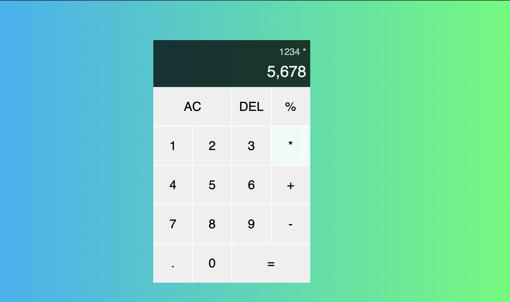

# calculator
creating my very first calculator app with the use of Javascript in the back end, Html and css for the front end. This is a very basic input and output application displaying both front and back end intergration.

